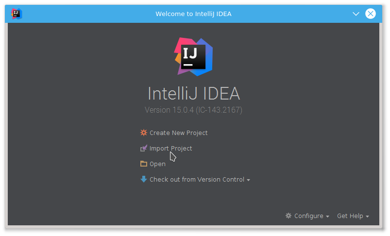
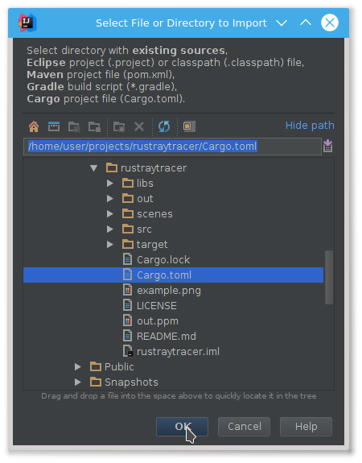
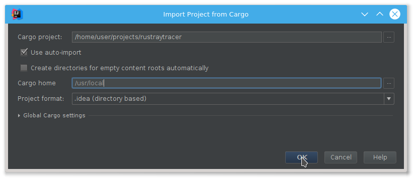
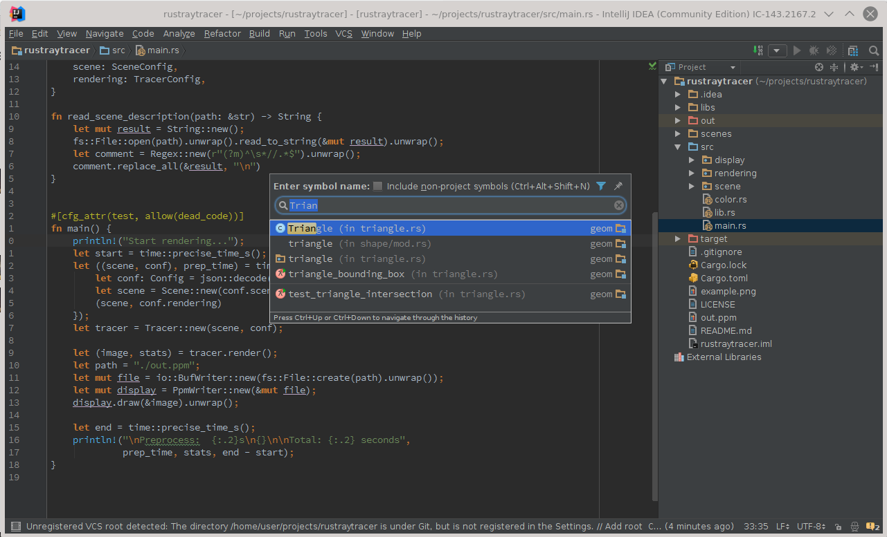

# Quick Start 

After you have installed the plugin and a recent version of Cargo, you can
import project. You can do this from the welcome screen, or you can use find
action (`Ctrl+Shift+A` > import project).

Select `Cargo.toml`.

Plugin should find cargo automatically, but you can specify the path to folder
with cargo via `Cargo home` setting:

Wait until Cargo downloads all project dependencies. To check that everything is
working, try go to symbol action (`Ctrl+Alt+Shift+N`) and type something.
 

# Usage

Use `import project` action and select appropriate `Cargo.toml` to teach the IDE
about your project. You will need a fairly recent version of `cargo` installed,
at least `cargo 0.9.0-nightly (6c05bcb 2016-01-29)`. Note that you can use
nightly cargo with stable Rust just fine.

You can also just `open` your project, but in this case `go to definition`
support will be limited and `go to symbol` will not work for dependencies.

Please note that most of the features are missing at the moment.

* There is no run configurations yet, you have to use the command line or an
  external tool integration to build your project. You can start a shell from
  the IDE with `Alt+F12`.
* Only basic completion is implemented. You can use `expand word` (`Alt+/` by
  default) to complete based on the words present in the file.
* Formatting support is very basic, so `reformat code` will not do what you
  want.

## Features

* `Go to definition` for local variables and items.
* `Go to class/symbol` (`Ctrl+N`, `Ctrl+Shift+N`)
* `File structure`, aka imenu (`Ctrl+F12`, `Alt+7`).
* `Basic completion`
* `Expand selection` (`Ctrl+W`).
* `Live templates` aka snippets (`Ctrl+J`).

## Intentions

Use `Alt+Enter` to invoke an intention.

* `Expand Module`: inside `foo.rs` file invoke this action to get `foo/mod.rs`.
* `Create Module`: if you have unresolved `mod foo;` this intention will create
  `foo.rs`. It's a convenient way to add a new Rust file: just type `mod bar;` and
  press `Alt+Enter`.

## Live Templates

Use `Ctrl+J` to view the list of templates applicable in the current context.

* In Rust File:
  - `p`, `pd`, `ppd` -- `print!` a (debug representation) of a value,
  - `a`, `ae` -- `assert!` / `assert_eq!`,
  - `tmod` -- test module boilerplate,
  - `loop`, `while`, `for` surround templates.

* In Rust structure:
  - `f` -- field name and type.
  - `pf` -- `pub` filed.

## Tips

You may find [external tools](https://www.jetbrains.com/idea/help/external-tools.html)
useful to invoke cargo commands. You can create tools for `cargo run` and `cargo fmt`
and assign shortcuts to them.

## Editors

We also have guides for [Emacs](Emacs.md) and [Vim](Vim.md) users :)
