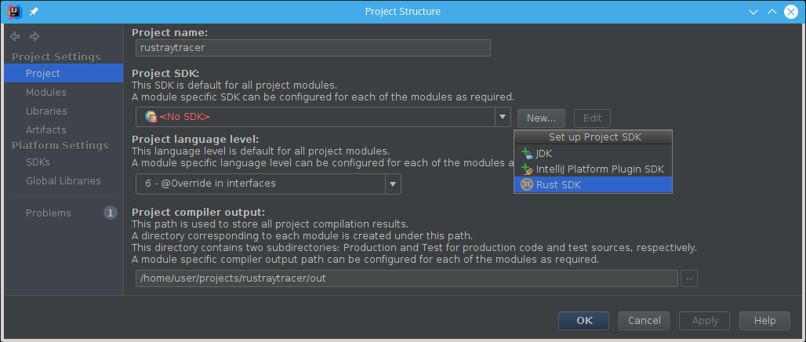
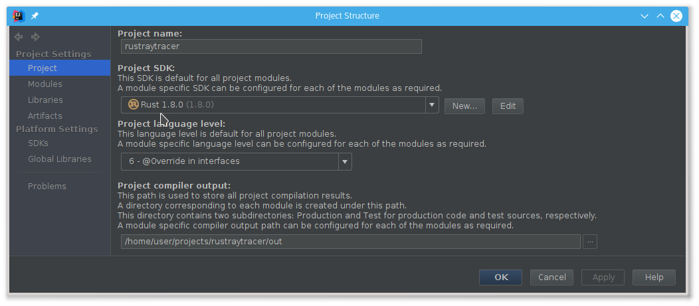
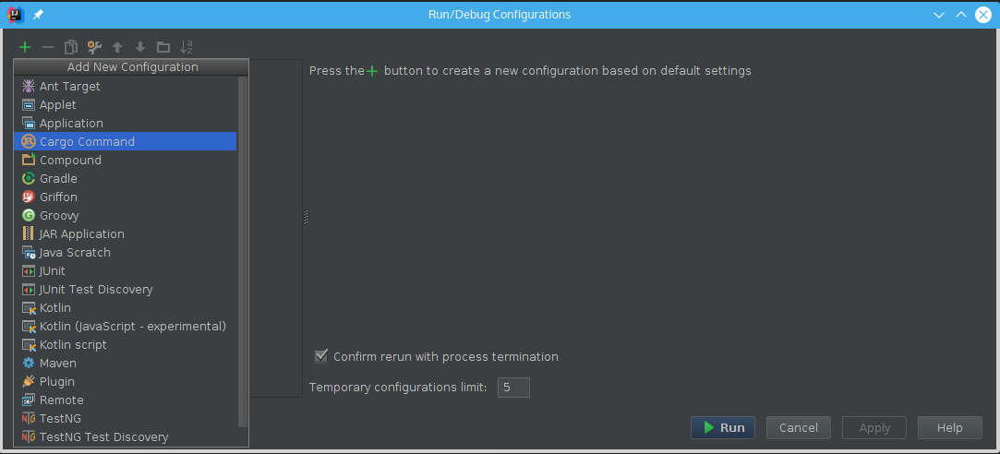
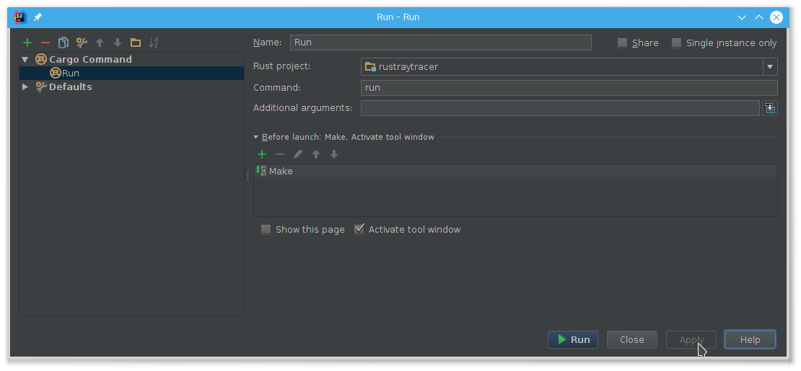
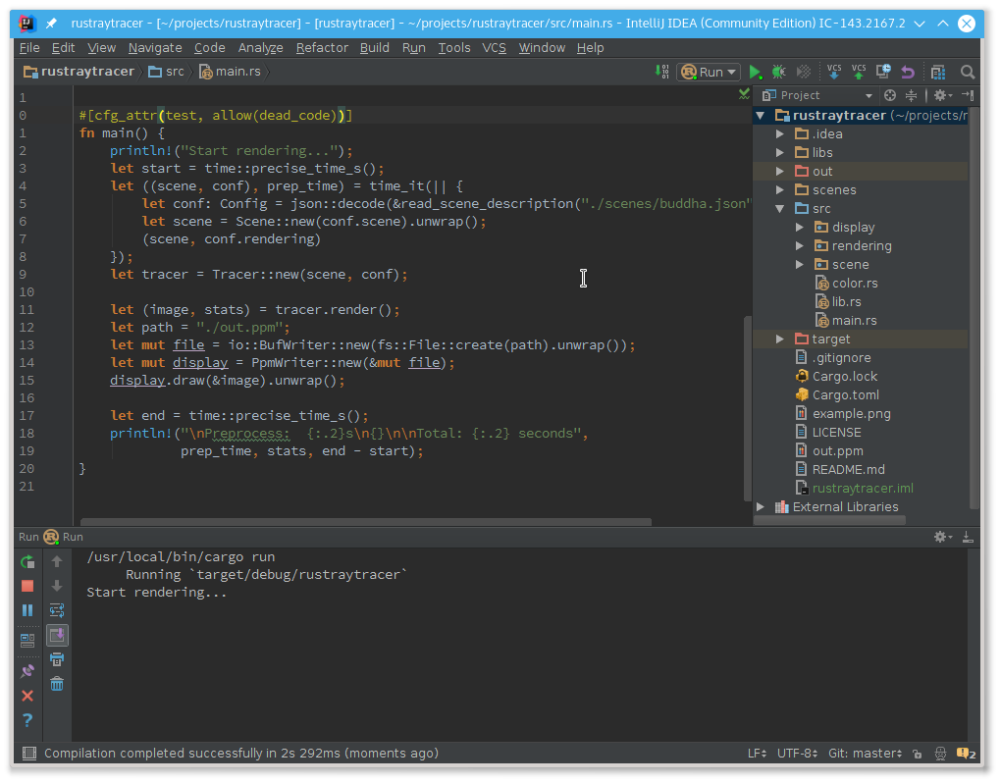

**Bold text** denotes the names of actions you can type in the **Find Action**
  dialog (`Ctrl+Shift+A`).

# Quick Start

After you have installed the plugin and a recent version of Cargo, you can
**import project**. You can do this from the welcome screen.

Select `Cargo.toml`.

Plugin should find Cargo automatically, but you can specify the path to folder
with Cargo via `Cargo home` setting:

Wait until Cargo downloads all project dependencies. To check that everything is
working, try **Goto Symbol** (`Ctrl+Alt+Shift+N`) and type something.

To execute Cargo tasks from within IDE, you need to set up a [Rust
SDK](https://www.jetbrains.com/idea/help/sdk.html) and a [Run
Configuration](https://www.jetbrains.com/idea/help/creating-and-editing-run-debug-configurations.html).
At the moment you also need to update the Kotlin plugin to the latest version.

SDK is setup in the **Project Structure** (`Ctrl+Alt+Shift+S`) dialog:

Again, IDE should automatically pick up the path to the directory with Cargo.

Next, **Edit configurations** (`Alt+Shift+F10`) and add a "Cargo command" config.

Fill in the name of command and additional arguments.

You should be able to compile and run your application from IDE now:

# Usage

Use **import project** action and select appropriate `Cargo.toml` to teach the IDE
about your project. You will need a fairly recent version of `cargo` installed,
at least `cargo 0.9.0-nightly (6c05bcb 2016-01-29)`. Note that you can use
nightly cargo with stable Rust just fine.

You can also just **open** your project, but in this case **Goto declaration** (`Ctrl+B`)
support will be limited and **Goto Symbol** (`Ctrl+Alt+Shift+N`) will not work for dependencies.

Please note that most of the features are missing at the moment.

* Only basic completion is implemented. You can use **Expand Word** (`Alt+/`) to
  complete based on the words present in the file.
* Formatting support is basic, so **Reformat Code** (`Ctlr+Alt+L`) will not format everything correctly.
  You may want to setup `rustfmt` as an [external tool](https://www.jetbrains.com/idea/help/external-tools.html).

## Features

* **Goto Declaration** for local variables and items.
* **Goto Class/Symbol** (`Ctrl+N`, `Ctrl+Shift+N`).
* **File Structure**, aka imenu (`Ctrl+F12`, `Alt+7`).
* `Basic completion`.
* `Expand selection` (`Ctrl+W`).
* `Live templates` aka snippets (`Ctrl+J`).
* Run configurations.

## Intentions

Use `Alt+Enter` to invoke an intention.

* **Expand Module**: inside `foo.rs` file invoke this action to get `foo/mod.rs`.
* **Contract Module**: the opposite of **Expand Module**.
* **Create Module File**: if you have unresolved `mod foo;` this intention will create
  `foo.rs`. It's a convenient way to add a new Rust file: just type `mod bar;` and
  press `Alt+Enter`.

## Live Templates

Use `Ctrl+J` to view the list of templates applicable in the current context.

* In Rust File:
  - `p`, `pd`, `ppd` -- `print!` a (debug representation) of a value,
  - `a`, `ae` -- `assert!` / `assert_eq!`,
  - `tmod` -- test module boilerplate,
  - `loop`, `while`, `for` surround templates.

* In Rust structure:
  - `f` -- field name and type.
  - `pf` -- `pub` filed.

## Editors

We also have guides for [Emacs](Emacs.md) and [Vim](Vim.md) users :)
